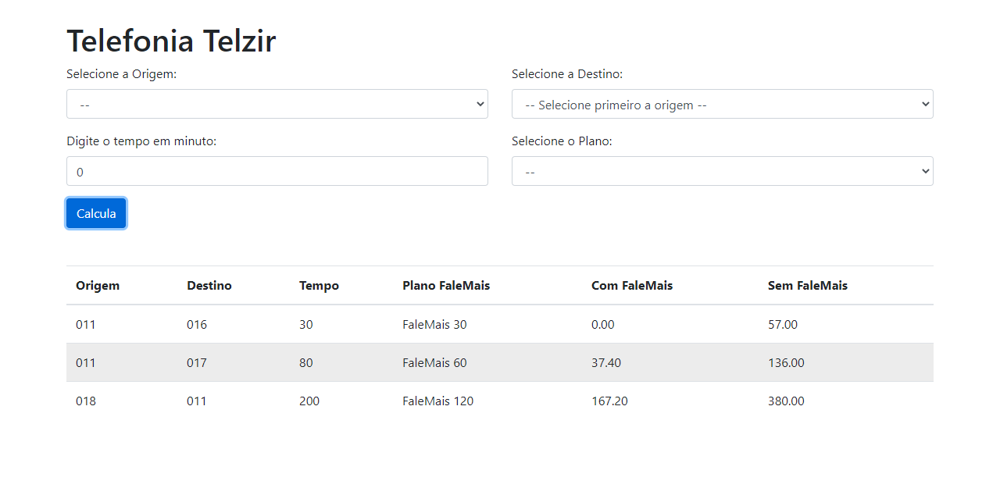

 

  

## 🚀 Tecnologias

Esse projeto foi desenvolvido com as seguintes tecnologias:

- [React](https://reactjs.org)
- [TypeScript](https://www.typescriptlang.org/)
- [Redux](https://redux.js.org/)

## 💻 Projeto

Este projeto apenas um simulado de tarifas eletronicas, os dados são fictions, e apenas para fins de estudo.

## :memo: Licença

Esse projeto está sob a licença MIT. Veja o arquivo [LICENSE](LICENSE.md) para mais detalhes.
